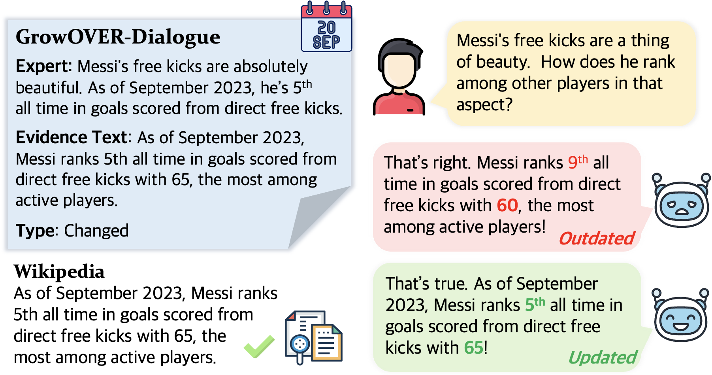

# GrowOVER
The source code for [GrowOVER paper](https://arxiv.org/abs/2406.05606) accepted in ACL 2024

## Dataset
You can download [GrowOVER-QA](https://drive.google.com/uc?export=download&id=1IcpH71gL1_S9BDIthhvjqj8rKE7HCp1R) and [GrowOVER-Dialogue](https://drive.google.com/file/d/1vnGBRDKeD0O9gxGC1ZUvMi7ySgbhQtoq/view?usp=sharing) here. Each zip file includes jsonl file from August to December.



## Dataset Generation
For dataset generation, we first generate initial QA and dialgue. After that, each time new Wikipedia snapshot is available, we perform 1) sentence labeling and 2) temporal updates.     
In 1) sentence labeling, we compare new Wikipedia snapshot to the previous one and label each sentence into unchanged, changed, and new.   
Then, in 2) temporal updates, we maintain datapoints if grounded texts are labeled as unchanged, and generate new datapoints if grounded text are labeled as changed or new.     
You can find source code for dataset generation are in dataset folder. Please refer to readme.md in each folder of the dataset forder. 

```
1. Sentence labeling --> dataset/sentence_labeling
2. QA generation --> dataset/generate_qa
3. Dialogue generation --> dataset/generate_dialogue
```

#### Dataset Configuration
The configuration of each line in jsonl file is as follows.
```
QA
---------------------
# qa.jsonl
{ wikipedia_article_id: [
              # qa instance 1
              {
               "title": a title of Wikipedia article,
               "type": CHANGED / NEW / SAME,
               "generated_month": "08" / "09" / "10" / "11" / "12",
               "question": a question, 
               "answer": an answer for the question,
               "grounded_text": an evidence text for the answer,
               "start_idx": starting index of grounded_text in the list of article sentences,
               "end_idx": ending index of grounded_text in the list of article sentences,
              },
              # qa instance 2
              {"title":,
               "type":,
               ""
              },
          ]
}

Dialogue
---------------------
# article_dialogue.jsonl
{ wikipedia_article_id: [
           IDs of corresponding dialogues
          ]
}
# dialogue.jsonl
{ dialogue_id: {
          "article_id": "303",
          "created_month": 8,
          "last_modified_month": 9,
          "dialogue_type": "SAME",
          "turn": {turn number: turn_id}
          }
}
# turn.jsonl
{ turn_id: 
          {
           "dialogue_id": dialogue ID
           "turn_number": the number of this ter in the dialogue #ID,
           "user": a question,
           "expert": an answer to the user, 
           "grounded_sentence": an evidence text of the expert turn,
           "sentence_type": type of this turn (CONTRADICT / NEW / SAME),
           "sentence_index": starting index of grounded_text in the list of article sentences,
           "created_month": 8, 9, 10, 11, 12
           "created_type": type of the dialogue #ID,
          }
}           
# 
```

## RiLM 
The RiLM, a retrieval-interactive generation framework, lets LLM evaluate its own answer and the retriever re-retrieve documents if LLM does not predict "reliable". This framework efficiently adapts LLM to the time-sensitive knowledge.   
In the inference folder, you can find source codes for RiLM. The "inference_qa" folder provides QA inference while "inference_dial" provides dialogue inference.    
Please run "pipeline.py" for inference as well as re-retrieval.